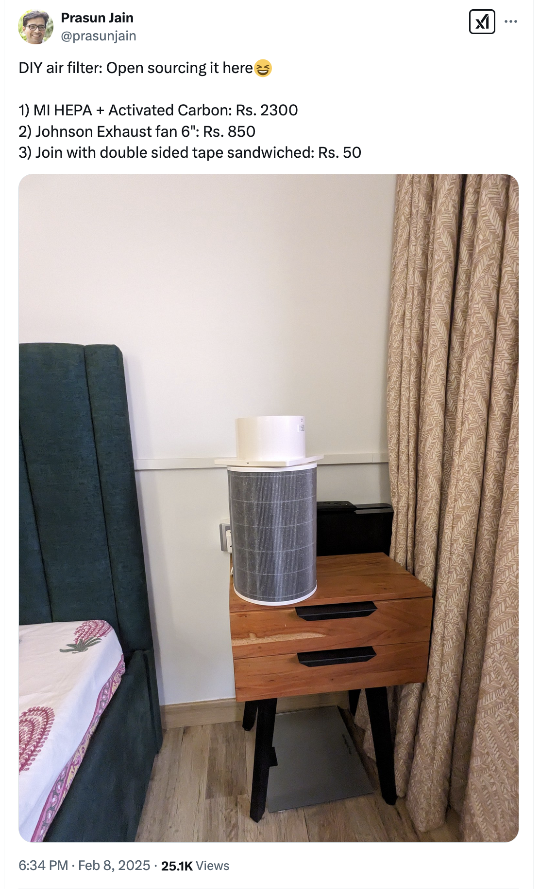

# Air Purifiers

> Commercial stand-alone air purifiers follow the razor blade & inkjet printer business model. The profit is made by selling poorly built but attractively designed machines with motors that burn out within two years, cannot be serviced and require expensive proprietary filters that only fit that specific air purifier model.
>
> ...
>
> **But aren't commercial air purifiers better?**
>
> Often not- depending on your use case. The use of centrifugal fans allows for more pressure than radial fans but at the cost of far more noise. Manufacturers often deceptively list the highest CADR their product can achieve but at its average or lowest noise levels. By using arrays of repurposed radial PC fans, we can make up the pressure- with far less noise. Those fans can also easily and inexpensively be replaced as needed.

While there are open designs like [Nukit Open Air Purifier](https://github.com/opennukit/Nukit-Open-Air-Purifier/) or the [Corsi–Rosenthal Box](https://en.m.wikipedia.org/wiki/Corsi%E2%80%93Rosenthal_Box), [Prasun Jain on Twitter](https://x.com/prasunjain/status/1888212282980663786) followed a [youtube video](https://youtube.com/shorts/x1CBnVFT0K0?feature=shared) to build a cheap, effective, modular, DIY air purifier. Then Ankit D [replicated this setup](https://www.linkedin.com/feed/update/urn:li:activity:7294743752387018752/) and even [measured the fan loudness](https://x.com/ankitdaf/status/1889297564727747058). Akhil from our whatsapp community has suggested using USB-powered PWM fans instead of generic exhaust fans for quietness:

<figure><figcaption></figcaption></figure>

The Internet is full of [individuals](https://x.com/ankitdaf/status/1897924674111389896) building [DIY Air purifiers](https://www.youtube.com/watch?v=eYOvnqoW4H0) which are very effective, quiet, repairable and budget-friendly.

